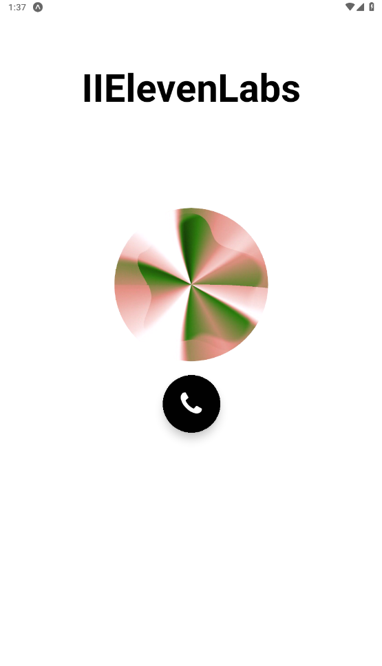

# 🎧 Expo Audio Player App eleven-music

A simple React Native app built with **Expo** that plays audio using the `expo-av` library.

## 📦 Tech Stack

- React Native + Expo
- `expo-av` for audio playback
- `expo` CLI for development and testing

## **Screenshots**
<!--  -->

<!--  -->

## 🚀 Features

- Play, pause, and stop audio
- Load audio from local assets or remote URLs
- Control playback state
- Built with Expo (Managed Workflow)

## 🛠 Installation

```bash
git clone https://github.com/devbit-space/eleven-music.git
cd expo-audio-player
npm install
expo install expo-av
